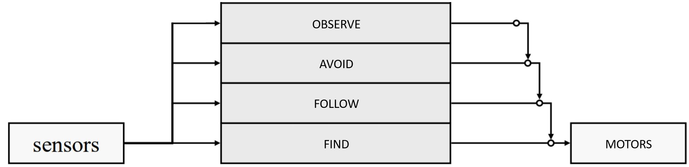

# Autonomous-Robotic-Systems

 

Introduction
-------------
In this project a LEGO Mindstorms robot is programmed to perform four main tasks of increasing priority: find the track, follow the track, avoid obstacles, stop at the middle of the longest straight. A short video of the robot can be found at the end of this README.
In order to achieve these goals, a Subsumption Architecture has been implemented. The Subsumption Architecture is composed of the following behaviours:
FIND: The robot goes straight on the white floor until the black track is detected.
FOLLOW: The robot turns in the direction of the track and steers to follows the inner edge of the track. Whenever the light sensor sees black the robot steers right to go towards the white part of the projection. whenever the light sensor sees white the robot steers left to return towards the black part of the projection.
AVOID: Whenever one of the two ultrasonic sensors detects an obstacle, the robot backs up, turns 90 degrees towards the centre of the track, and performs a semicircle around the object until it reaches the track.
OBSERVE: Saves the coordinates of the points at which the robot passes from white to black and from black to white. This allows to map the inner edge of the track. The points are fitted with lines and the longest straight is detected. The second time around the track the robot will stop in the middle of the longest straight.

***Figure 1:  Brooks Subsumption Architecture***
 
  
 
Behaviours
-------------
#### FIND
This behaviour runs whenever the robot is on white. The light values are collected using the function
HTCS2readRawWhite(colorSensor, true, lightValue);
A light value above 500 is considered to be white. While the readings are above 500, the motor speed of the right wheel and the left wheel are set to be equal so the robot goes straight until it finds the track. To filter out noise and anomalies, a sliding window of four values is averaged together. A bigger sliding window would be better at filtering out noise but would make the robot not responsive enough, as new values are averaged together with old values that are no longer relevant. Light values are collected with the light of the colour sensor turned off. It has been experimentally found to be a more robust solution.
Another way of distinguishing black from white is to calculate the standard deviation of the light values in a sliding window. The values are relatively steady while the robot is on black. On the other hand, the light sensor picks up much more noise while the robot is on white. Standard deviation can quantify this variance, and a value above 12 has been experimentally observed to correspond to the robot beeing on white. This method is independent of the overall light level in the room so it can be considered more robust and general-purpose.
However, for this particular application, a simple light reading gives the best performance. This is because standard deviation is computationally expensive and therefore requires a small sliding window for the robot to be responsive enough to detect the track. However, a small sliding window causes the readings to be prone to noise and a single value greater than 12 would result in the triggering of the Follow behaviour. If the Follow behaviour is triggered it takes 6 seconds to get back to Find, and the robot will wander aimlessly through this period of time. 
Throughout this project, simple, robust, and less computationally expensive solutions are preferred to complex solutions. 
 
#### FOLLOW
The Follow behaviour is set to active as soon as the track is detected. In this case, the track is detected using the standard deviation on light levels in a sliding window of size 3 as discussed above. This can be done because anomalous readings don’t have such a big impact on this behaviour and standard deviation allows for general-purpose colour detection.
The behaviour starts by steering in the direction of the course. The robot is currently seeing black because it has reached the course, and it steers right until it sees white again. When white is detected the robot is roughly aligned with the inner edge of the track and the second part of the behaviour can kickoff.
The second part of the behaviour consists of a controller that steers left when white is detected and right when black is detected. The intensity of the controller depends on the number of consecutive readings on the same colour. Therefore the robot will ideally aim to alternate a reading on black and a reading on white to always stay on the edge. The intensity of the controller does not increase linearly. This is because the robot needs to travel smoothly during straightaways and turn sharply when is required by the track. A classic controller is either very unstable on straightways or not able to turn sharply when needed. Therefore, the controller has been divided into three sections of increasing intensity. This allows the robot to go mostly straight when less than 10 consecutive readings are detected, and turn on itself when it has been on the same colour for more than 20 readings. In control theory terms, this controller is similar to an integral controller where the error piles up with the passage of time and is reset every time the error changes sign. This has been observed to be the most robust solution experimented.
Timer T1 is used to check whether the line has been detected in the past 6 seconds. The line has not been detected in the past 6 seconds the robot is considered lost, and the Follow behaviour is set to be inactive. 
Another possible solution experimented has been a PID controller. However, it has been observed that greater light levels or greater standard deviation values do not correspond to a greater distance from the track edge. The PID controller works only when the robot is really close to the inner edge but cannot be considered a general-purpose controller.

#### AVOID
The Avoid Behaviour is triggered whenever one of the two ultrasonic sensors detects an object at a distance of 6 cm or closer. A sliding window of 4 values is averaged together to filter out anomalous readings.
The robot backs up for 400 ms, turns 90 degrees towards the centre of the track, goes forward for 800 ms, and performs a semicircle around the object until it reaches the track again. Timer T2 has been used for the backup state, for the turn state and for the go-forward state. The 90 degrees rotation is obtained by setting the motor speeds to 4 and -4 for 3200 ms. A semi-circular path can be obtained by setting the two motor speeds at two constant values that are different from each other. The ratio of the two value determines the radius of the circle. The closer the two values are from each other the bigger the radius. If the two values are the same, the circle will have an infinite radius and the robot will just go straight. The radius of the circle has been chosen so the robot can consistently avoid the obstacles used during the labs.
This behaviour is set to inactive when the track is reached. Again, using standard deviation on a sliding window of light values of size 3 has been experimentally proven to be the most robust solution.
Other implementations of the Avoid behaviour have been tried, but none of them has been successful. They all involve the robot turning around to understand if the obstacle has been passed or if it should keep going. These solutions have the advantage of not relying on a fixed radius, however, they are way more complex and prone to error. Especially they rely too much on precise and consistent turns of 90 degrees. This is definitely an area that could be further investigated. Therefore, the current solution is to be considered simple and robust but not general-purpose. This is a compromise that have been reached due to the limited time available with the robot.

#### OBSERVE
Saves the coordinates of the points at which the robot passes from white to black and from black to white. This allows to map the inner edge of the track. The points are fitted with lines and the longest straight is detected. The second time around the track, the robot will stop in the middle of the longest straight. The observe code does not currently work and would need more testing and debugging. 
 
#### ARBITER
All the tasks run in parallel, outputting at all times a right motor speed and a left motor speed. The arbiter task is the task that decides which of the motor speeds generated are used by the robot at any instant. The first behaviour to be active is the Find behaviour. Find is always active when the robot is on white, and therefore not on the track. As soon as the track is detected the Follow behaviour will become active. If the track has been detected in the last 6 seconds the Follow behaviour will stay active. The Follow behaviour has a higher priority than the Find behaviour so the latter is suppressed. If the track It lost for more than 6 seconds the robot goes back to Find. When the ultrasonic sensors detect an obstacle, both Find and Follow are suppressed. During the semicircle stage of Avoid, the behaviour will be set to inactive if the line is detected. The Follow behaviour will subsume. The Observe behaviour can suppress every other behaviour if the robot is in the proximity to the middle of the longest straight. When in this position the motor speeds will be set to 0 and the behaviour will stay active until the robot is manually stopped from running.

 

Discussion & Conclusion
-------------
Throughout this project, Find, Follow, and Avoid behaviours that work under most conditions have been achieved. The Follow behaviour is limited by the speed at which the light values are collected. The code should be made more efficient for the light values to be collected faster, which would allow the use of a bigger sliding window. This could be done for example by dividing the current tasks into smaller tasks. The Avoid behaviour, if more time with the robot was available, would have been modified to a general-purpose behaviour that could avoid obstacles of all sizes. Such behaviour could be effective if the responsiveness of the robot was increased. Low responsiveness results in errors in the turning angles. The Observe behaviour does not currently work. It was of higher priority to ensure all other behaviours could perform at their best.
This coursework was an effective way of learning about hardware programming and how unpredictable real-world situations can be in comparison to simulations. I definitely made good progress in this area and gained new hand-on skills.

 

 
